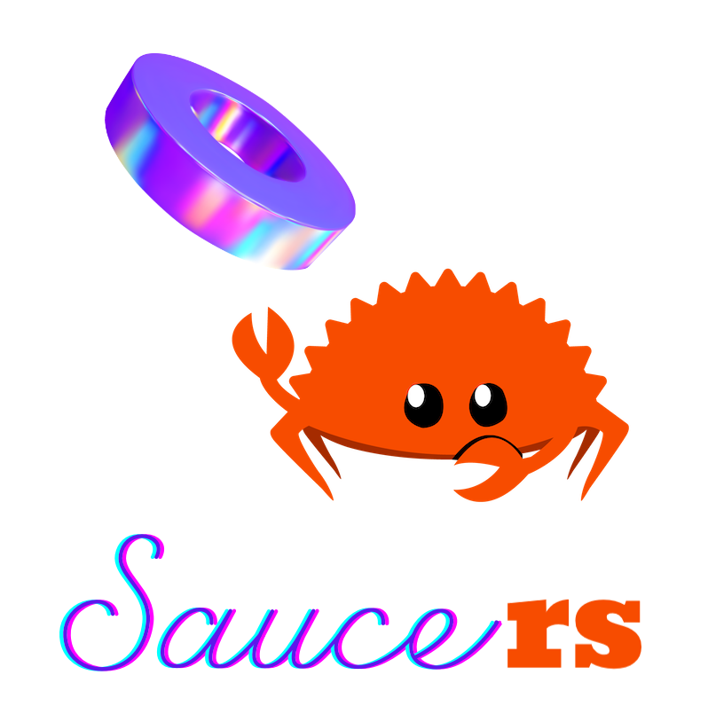

<hr/>

<div align="center">

</div>

<p align="center">Rust bindings for <a href="https://github.com/saucer/saucer">saucer</a></p>

---

## Why?

[Saucer](https://github.com/saucer/saucer) is a cool webview library.

[Rust](https://rust-lang.org) is a cool language.

And by putting them together you can build cooler hybrid apps.

## Prerequisites

This library pulls saucer (and its dependencies) and compiles them on the fly when building.
Additional tools/libraries are needed for such workflow:

- A nightly Rust compiler (refer to [`rust-toolchain.toml`](rust-toolchain.toml) for recommendation).
- A C++ compiler which supports C++23. Clang 17+ is recommended as it can also be used to perform cross-language LTO and
  emit bindings.
- Clang 9+ or corresponding `libclang` (for `bindgen`).
- GNU patch (for patching certain source files of saucer).
- Make sure to have [system dependencies](https://saucer.app/docs/getting-started/dependencies) installed.
- CMake. For cross-language LTO you also need Ninja.
- When building for Windows, MSVC is required (MinGW will likely not to work). For cross-language LTO, `clang-cl` and
  `lld-link` are also required.

Saucer uses CPM to pull compile-time dependencies. It may take noticeable time to compile this crate during the build
process.

## Example

> [!WARNING]
>
> This project is still under development and the API is subject to change at any time.

Examples can be found in the [`examples`](examples) directory. Additionally, for a one-file quick demonstration, see
[`src/main.rs`](src/main.rs):

```rust
use saucers::app::App;
use saucers::options::AppOptions;
use saucers::prefs::Preferences;
use saucers::webview::events::DomReadyEvent;
use saucers::webview::events::FaviconEvent;
use saucers::webview::Webview;

fn main() {
    // Create an app to manage the event cycle.
    // The app returns a collector which must be kept to live longer than all `App`s and `Webview`s.
    // It detects leaks internally and gives a panic when dropped incorrectly.
    let (cc, app) = App::new(AppOptions::new("saucer"));

    // Customize webview behavior using a preference set.
    let mut prefs = Preferences::new(&app);
    prefs.set_user_agent("saucer");

    // Create a new webview instance.
    let w = Webview::new(&prefs).unwrap();
    drop(prefs);

    // Register a one-time listener for DOM ready event.
    // Prefer using the handle argument instead of capturing to prevent cycle references.
    w.once(
        DomReadyEvent,
        Box::new(move |w| {
            w.execute("window.saucer.internal.send_message(`Hello! Your user agent is '${navigator.userAgent}'!`);");
        })
    );

    // Registers a repeatable event handler for favicon event.
    let on_favicon_id = w.on(
        FaviconEvent,
        Box::new(|_, icon| {
            println!("Wow, you have a favicon of {} bytes!", icon.data().size());
        })
    );

    // Handles incoming webview messages.
    // This API forwards the message as-is, allowing more complex channels to be built on it.
    w.on_message(|_, msg| {
        println!("Browser: {msg}");
    });

    // Set several runtime properties for webview.
    w.set_url("https://saucer.app");
    w.set_size(1152, 648);
    w.set_dev_tools(true);
    w.set_title("Saucer + Rust");

    // Show and run the app.
    w.show();
    app.run();

    // An event handler can be cleared using its ID.
    w.off(FaviconEvent, on_favicon_id);

    // Rust will clean up everything in correct order. But to make it clear, we will drop it manually.
    drop(w);
    drop(app);
    drop(cc);
}
```

You can use `cargo run --package saucers --bin saucers` to run this example after added it as a dependency.

## Linking

### Static vs. Dynamic

This library can be configured to produce either static or dynamic library.
Linking to the static library eliminates the need of shipping additional dynamic library files, but will result in
larger binary unless cross-langauge LTO is enabled (which involves some non-trivial setups).

Enable feature `static-lib` to emit a static library (enabled by default) whenever possible.
For platforms that's not currently supported, a dynamic library is built as the fallback.

### Cross-Language LTO

One of the many advantages of saucer is its tiny size.
However, when using static linking, this advantage can be nerved due to the lack of LTO.
For a simple "Hello World" app, such impact can lead to doubled binary size.

Good news is that you don't always need to switch back to dynamic library for the size!
By leveraging linker plugins, it's possible to enable LTO even across the language border.
Follow these steps to begin:

1. Make sure you have Clang and Ninja installed (support of other build systems are in progress).
   On Windows, `clang-cl` and `lld-link` are also needed in order to link with the MSVC target.
   Make sure that the Rust compiler has the same LLVM major version as Clang:

   ```shell
   rustc -vV    # LLVM version: 20.1.5
   clang -v     # clang version 20.1.7
   ```

   Add these tools to `PATH` so CMake and Cargo can find it.

2. Enable the `cross-lto` feature in `Cargo.toml` or when compiling.
   This instructs the build script to toggle certain flags of CMake to enable LTO.

3. Make sure to use LLD as the linker for the Rust part.
   This can be done by appending the following to `.cargo/config.toml`:

   ```toml
   [target.x86_64-pc-windows-msvc]
   rustflags = ["-Clinker-plugin-lto", "-Clinker=lld-link"]

   [target.'cfg(any(target_os = "linux", target_os = "macos"))']
   rustflags = ["-Clinker-plugin-lto", "-Clinker=clang", "-Clink-arg=-fuse-ld=lld"]
   ```
4. Run the build in release mode. You should see the binary size being greatly reduced.

> [!NOTE]
>
> On Windows, you might encounter errors when compiling proc-macros.
> This can be fixed by adding `--target x86_64-pc-windows-msvc` when invoking Cargo.

## Known Limitations

- This project is built on top of the [C-Bindings for saucer](https://github.com/saucer/bindings), which exports only a
  subset (major parts, but not all) of the C++ API. We currently have no plan to integrate with the C++ API.
- Backend cannot be customized yet.
- Safety (mostly the `Send` trait) of certain APIs are not fully verified.

## License

This project is released under the [MIT License](https://mit-license.org) to make licensing consistent with saucer
itself. 