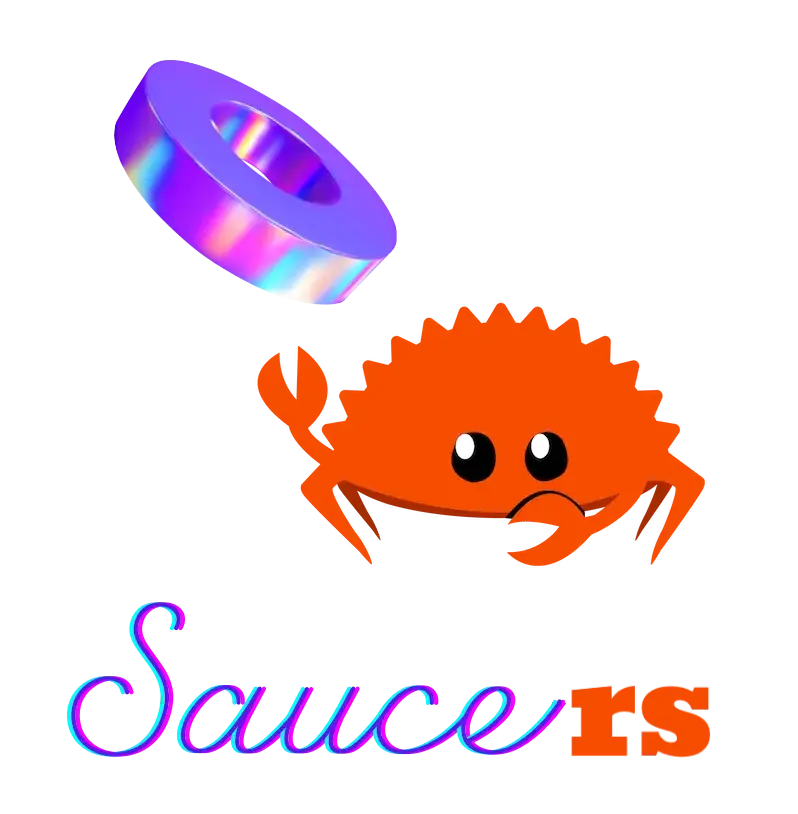

<!--suppress HtmlDeprecatedAttribute -->

Rust bindings for <a href="https://github.com/saucer/saucer">saucer</a>

<a href="https://skjsjhb.github.io/saucers/saucers/index.html">Documentation</a>

---

 

## Why?

[Saucer](https://github.com/saucer/saucer) is a cool webview library.

[Rust](https://rust-lang.org) is a cool language.

And by putting them together you can build cooler hybrid apps.

## Prerequisites

This library is built on top of [saucer-sys](https://github.com/skarl3t/saucer-sys), to which we've
offloaded most compilation setups. See the README there for details.

## Examples

> [!WARNING]
>
> This project is still under development and the API is subject to change at any time.

Examples can be found in the [`examples`](examples) directory.

## Saucer Modules

Two official modules ([desktop](https://github.com/saucer/desktop)
and [pdf](https://github.com/saucer/pdf)) are included. Support for custom modules are not yet
planned.

## Cargo Features

This crate comes with the following togglable features:

- `gen-bindings`: Generates bindings on-the-fly.
- `qt`: Enables the Qt backend.
- `lto`: Enables cross-language LTO.

These features are forwarded into `saucer-sys`, see the docs there for details.

## MSRV

This project is currently unstable and has only been tested on the latest stable Rust version.
Although earlier versions will also likely to compile, we provide no such guarantee.

## Known Limitations

- This project is built on top of the [C bindings](https://github.com/saucer/bindings), which
  exports only a subset of the C++ API. We currently have no plan to integrate with the C++ API.
- Cross-compilation is not supported (and won't likely to be in the near future).

## License

This project is released under the [MIT License](https://mit-license.org) to make licensing
consistent with saucer itself. 